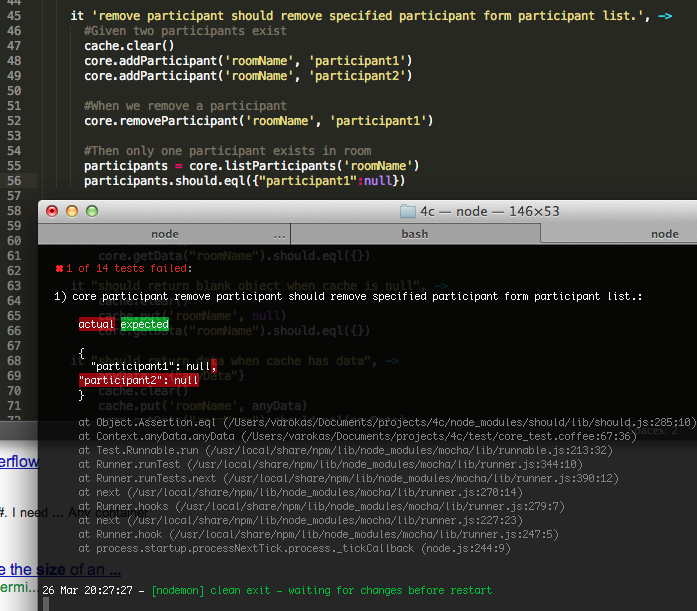

Test Driven Development
===

TDD ดูเหมือนเป็นเรื่องน่ากลัว ที่จะมี automated test ครอบคลุมทุกเงื่อนไขของโปรแกรม แต่เป็นเรื่องปกติสำหรับทีมที่จะเป็นอไจล์อย่างยั่งยืน จุดสำคัญ
ของการจะรีลีสผลงานได้บ่อยๆ อย่างมีคุณภาพ คือ การที่เราต้องมั่นใจได้ว่า ของที่เราเขียนไปนั้น
จะสามารถใช้งานได้เสมอตลอดเวลา ถ้าเรารีลีสทุกสัปดาห์ หรือบ่อยกว่านั้น จะมาเสียเวลากับการ นั่งเทสเป็นชั่วโมงๆ ด้วยมือไม่ได้

Steps
---
สำหรับมือใหม่ที่นึกไม่ออกว่าทำ TDD ยังไง แนะนำให้ทำตามขั้นตอนนี้

1. เขียน spec ของสิ่งที่ต้องการจะเทสเป็นคอมเมนท์ เป็นขั้นตอนไว้
2. แปลงจากคอมเมนท์ด้านบนทีละบรรทัดมาเป็นเทส
3. รันให้เห็นว่าเทสมัน fail จริงๆ (มันควรจะไม่ผ่านเพราะระบบเรายังไม่ได้ implement case นี้เลย)
4. ไปแก้โค้ดให้เทสผ่าน
5. refactor code ให้สวยงาน
6. refactor test

TDD Tips
---

### Testing External Dependencies 
ถ้าเราไม่ได้ทำ TDD ตอนออกแบบโปรแกรมมาแต่แรก จะพบว่า เราจะเทสกับอะไรที่มี library ข้างนอก ยากมาก นั่นมาจากการที่เราต้องเทสว่าเราเรียก library ได้อย่างถูกต้อง และยังต้องเทสว่า library นั้นมีผลลัพธ์กลับมาถูกต้อง หรือไปทำสิ่งที่ถูกต้องด้วย เพราะสองอย่างนี้มีเกาะกันอยู่เป็นก้อนเดียว 
เทสเรามีจุดเข้าจุดเดียวคือ ผ่านการเรียกโค้ดที่เราเขียน

ซึ่งนับว่าเป็น Unit Test ที่ไม่ดี เพราะพยายามเทสหลายอย่างพร้อมกัน ทำให้รันช้า และที่แย่ที่สุด
คือ เมื่อเทส fail จะเกิดได้จากหลายสาเหตุ ตั้งแต่โค้ดเราผิดเอง จนถึง library ทำงานเปลี่ยนไป

                                      
    Test ----> [Code Under Test] ----> [External Library]
    (Assert both code and ext library behavior)

การที่เราจะแบ่งมันเป็น unit test ได้นั้น วิธีที่ทำได้คือ ทำให้เราแยกออกมาว่าเราจะเทส
เฉพาะว่าเราเรียก library ได้ด้วย parameter ที่ถูกต้องก็พอ

                          (prod)  
    Test ----> [Code]  -----------> [Ext. Library]
                          |
                          --------> [Mock]
                          (test)

    (Assert Code call mock with correct parameters)

ซึ่งตอนหลังเราอยากจะมีเทสว่า library ส่งค่ากลับมาถูกต้องหรือไม่ อันนี้แล้วแต่เรามั่นใจว่า API
ของ library นั้นเสถียรแค่ไหน

### Testing Legacy Javascipt on a page

การเทส JavaScript บนเพจดูจะซับซ้อนกว่าส่วนอื่นๆ ซึ่งมาจากการที่ตัวภาษาและ framework ต่างๆ มี coupling กับ browser สูง คนออกแบบเริ่มแรกคงคิดว่า javascript ยังไงๆ ก็เอาไว้สั่งการวัตถุต่างๆ
ที่อยู่บนหน้าเพจ จะเอาเร็วๆ ก็เลยทำให้ภาษาสั้นกระชับ แต่ทำให้มันเกาะอยู่กับหน้าเวบอย่างแน่นหนามาก

coupling นี้ ก็มีทั้งทางกลับกันด้วย คือ ตัว Event จากเวบ ก็จะเรียก function ของ javascript ที่กำหนดไว้ ถ้าไม่ได้ออกแบบให้สลับ function อื่นเข้ามารับได้ event พวกนี้แทน
ของจริงได้ง่าย ก็จะทำให้ unit test ได้ยาก

สังเกตได้จาก เฟรมเวิร์คหลายๆ ตัว แทบไม่ได้เอื้อต่อการเทสเลย ตัวอย่างเช่นใน project foresee ที่ใช้ library ในการสร้าง QRCode ซึ่งจริงๆ แล้ว จะใช้การส่ง url ที่ต้องการไปให้มันตอบเป็น binary ของ image ก็ได้ แต่มันไม่ได้ทำอย่างนั้น

จะเห็นได้ว่า ถ้าไม่ระวังดีๆ frontend javascript จะไม่ค่อยเอื้อกับการแบ่งเป็นโมดูลๆ เท่าไหร่ 

จากการสังเกต พบว่า javascript ตามที่นิยมใช้กัน มักจะเป็นดังนี้

     [Server]  ---------> [Page] ------------> [JS Code] -----------> [JQuery]
        (renders HTML)      /\       (event)                (calls)        |
                             |                                             |
                             -----------------------------------------------

เมื่อมองได้ดังนี้แล้ว แนะนำได้ว่าให้เทสได้แบบนี้
* มองตัวเทสเองเป็น browser ที่คอยเรียก function ใน JS Code ตาม event ที่ต้องการเทส
* Mock JQuery (หรือ driver ตัวอื่นๆ) ขึ้นมา แล้ว assert ดูว่าเราส่งคำสั่งไปให้ถูกต้อง
* สิ่งที่ขาดไปคือ JQuery message ไปหา browser อันนี้ช่วยไม่ได้ ทำได้ดีที่สุดที่นึกออกตอนนี้คือ
   * ถ้าอ้างถึง Element ID = X ก็ต้องไป test ว่า server ใส่ X ลงมาใน template จริงๆ
   * หรือไม่ก็เก็บ integration test ด้วย selenium

ซึ่งจะออกมาในรูปแบบนี้

    [code.coffee]
    Controller = (jq) ->
       onLoad() -> 
         jq("#id").val("abc")
    
    [page.php]
     
    
    
    [test.coffee]
    it "test OnLoad", ->
      mockJQ = mock()
      c = controller(mockJQ)
      c.onLoad()

      expectJqueryCalledWith("#id").andThenCalls(val("abc"))

ปล. หลังจากศึกษาดูแล้วพบว่า เฟรมเวิร์ครุ่นใหม่ๆ อย่าง Backbone.js และ AngularJs แก้ปัญหานี้ไปได้หลายส่วน ถ้าจะเขียนเวบใหม่ลองมองๆ พวกนั้นก็น่าจะช่วยได้เยอะ เทคนิคข้างบนพวกนี้เก็บไว้จัดการกับ Legacy Code ก็ได้

###Bug Fixing
เวลาจะแก้บั๊ก แนะนำให้เขียนเทสแล้วให้เทสมัน fail จริงๆ ให้ดูซักครั้งนึงก่อน หลายคนทำ TDD จากกระดาษเปล่าๆ ไม่เป็น แต่สามารถแก้บั๊ก
ด้วย TDD ได้คล่อง เพราะว่าจะได้มาจาก QA แล้วว่า เมื่อมี precondition แบบนี้ เวลารันโค้ดนี้แล้ว เราคาดหวังว่าจะได้ผลลัพธ์เป็นอย่างไร
ก็แปลงเป็น Given, When, Then ได้โดยตรง

ดังนั้นถ้าใครเริ่ม TDD ไม่ถูก อาจจะลองเริ่มด้วยการแก้บั๊กก่อนก็ได้

เขียนเทสเสร็จแล้วค่อยไปแก้โค้ด แล้วก็รันให้ผ่านก็เป็นอันจบ

และเวลาใส่เทสเคสนี้เข้าไปแล้ว ระบบเราก็จะไม่พังด้วยกรณีนี้อีก

